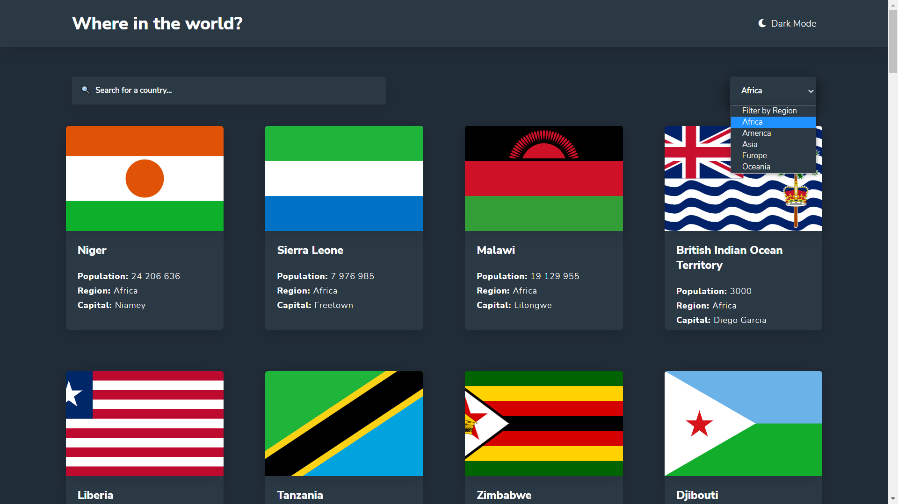
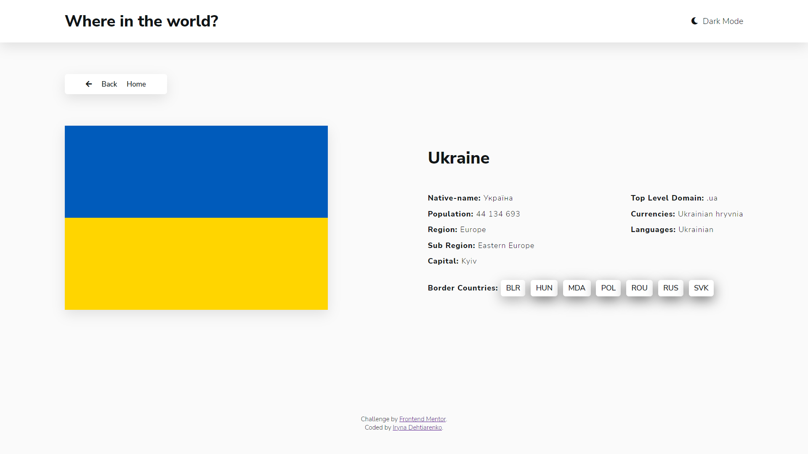
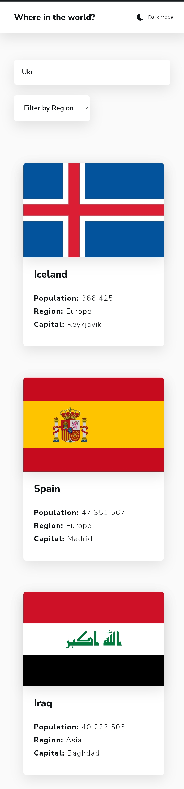
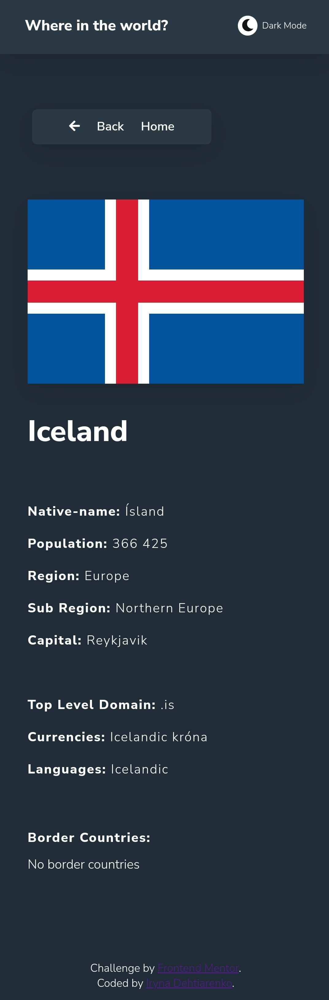

# Frontend Mentor - REST Countries API with color theme switcher solution

This is a solution to the [REST Countries API with color theme switcher challenge on Frontend Mentor](https://www.frontendmentor.io/challenges/rest-countries-api-with-color-theme-switcher-5cacc469fec04111f7b848ca).

## Table of contents

- [Overview](#overview)
  - [The challenge](#the-challenge)
  - [Screenshot](#screenshot)
  - [Links](#links)
- [My process](#my-process)
  - [Built with](#built-with)
  - [Useful resources](#useful-resources)
- [Author](#author)

## Overview

### The challenge

Users should be able to:

- See all countries from the API on the homepage
- Search for a country using an `input` field
- Filter countries by region
- Click on a country to see more detailed information on a separate page
- Click through to the border countries on the detail page
- Toggle the color scheme between light and dark mode _(optional)_

### Screenshot

- Desctop main page view - dark theme

- Desctop details page - light theme

- Mobile main page view - light theme

- Mobile details page view - dark theme

### Links

- Solution URL: [My solution URL here](https://github.com/Irina-Dehtiarenko/REST-Countries-API-with-color-heme-switcher)
- Live Site URL: [My live site URL here](https://irina-dehtiarenko.github.io/REST-Countries-API-with-color-heme-switcher/)

## My process

### Built with

- Semantic HTML5 markup
- CSS custom properties
- Responsive style with @media
- Flexbox
- Java Script
- REST API
- Git commits

### Useful resources

- [Object.values() from developer.mozilla](https://developer.mozilla.org/en-US/docs/Web/JavaScript/Reference/Global_Objects/Object/values) - This helped me understand how to changed an object to an array. I really liked this website and will use it in the future.
- [Dark Theme z localStorage i CSS variables!](https://www.youtube.com/watch?v=gTX--uDIE9Y&ab_channel=Jakzacz%C4%85%C4%87programowa%C4%87%3F) - This is an amazing video that helped me understand how to save a recently used theme (light or dark) in the local storage. I would recommend it to anyone who is still learning the concept.

## Author

- Git - [Irina-Dehtiarenko](https://github.com/Irina-Dehtiarenko)
- Frontend Mentor - [@Irina-Dehtiarenko](https://www.frontendmentor.io/profile/Irina-Dehtiarenko)
- Linkedin - [Iryna Dehtiarenko](linkedin.com/in/iryna-dehtiarenko-7b0486206)
